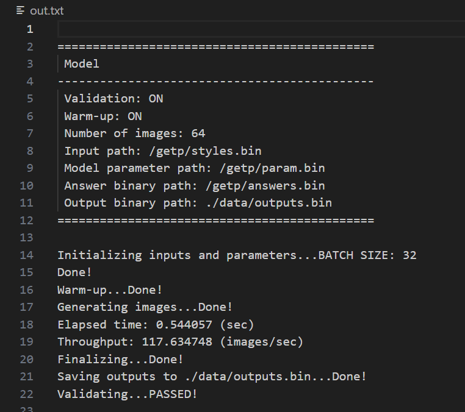
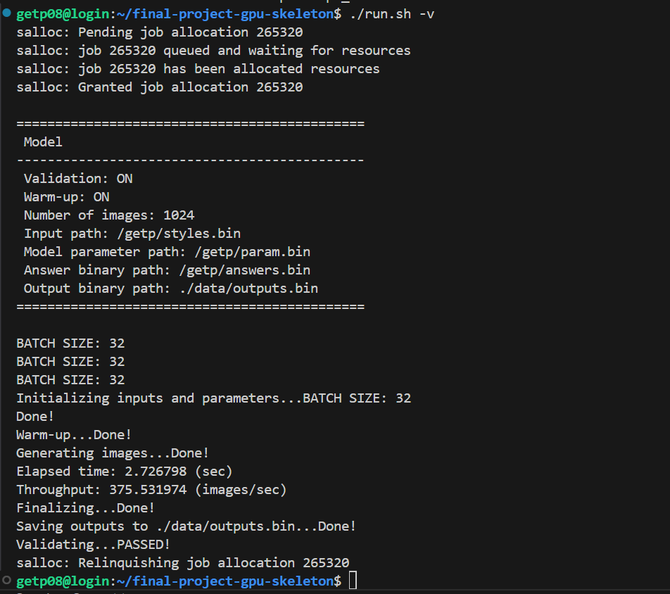

# StyleGAN inference pipeline from Scratch on NVIDIA GPUs

## Overview

This a pure C++ implementation of StyleGAN model designed to **maximize inference throughput on NVIDIA GPUs without relying on external libraries**. Our goal is to explore end-to-end model optimization, from kernel-level improvements to system-level design, providing insights for researchers and developers interested in high-performance computing and model-level optimization.

Our implementation uses CUDA and avoids dependencies such as cuBLAS and cuSPARSE. We utilize multiple optimization strategies for optimizing the inference pipeline, including but not limited to batching, multi-streaming, optimized CPU–GPU–SRAM memory access, and two-pass convolution (im2col + matrix multiplication).

Experiment on a four‑node cluster, with each node equipped with 4×RTX3090 GPUs (total 16 GPUs), shows that my implementation achieves about 375 images per second in custom benchmarks, demonstrating the effectiveness of our optimizations and the strong potential of NVIDIA GPUs for large-scale inference.

---

## Experiments

| Model       | Num nodes (each contains 4×RTX3090 GPUs) | Throughput (imgs/sec) |
| ------------| ---------------------------------------- | --------------------- |
| `StyleGAN`  | 1                                        | 112.5                 |
| `StyleGAN`  | 4                                        | 375                   |

  <table>
    <tr>
      <td align="center">
         
        <b>Performance on single node</b>
      </td>
      <td align="center">
         
        <b>Performance on 4 nodes</b>
      </td>
    </tr>
  </table>

## Acknowledgments

This project was part of the GPU Engineer Training Program, a collaboration between [Moreh](https://www.linkedin.com/company/moreh-inc) and [THUNDER Research Group](http://snuvm.snu.ac.kr/) (Seoul National University).